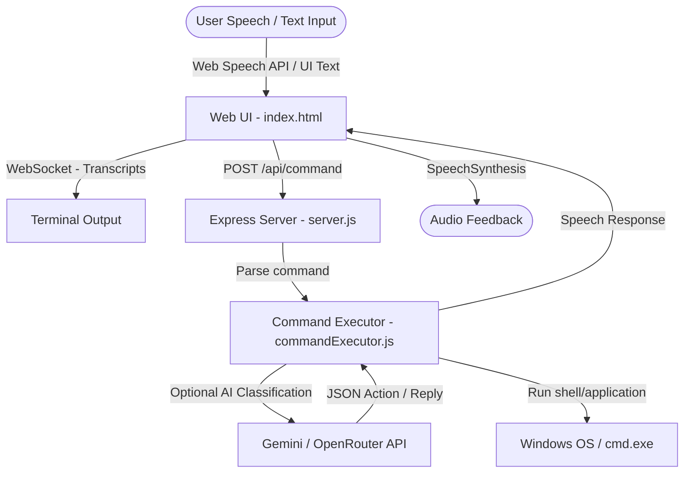

# 🌌 Nova: AI-Powered Voice & System Controller

<div align="center">

[](https://nodejs.org)
[](https://microsoft.com)
[](https://deepmind.google)
[](https://opensource.org/licenses/MIT)

**Speak or type naturally, and watch Nova execute desktop and system operations instantly on Windows.**

[🎥 Demo Video](https://drive.google.com/file/d/1NoJreXUiqZFGdH9ErkbiXJb_4MomUGze/view?usp=drive_link) • [Features](#-features) • [How It Works](#%EF%B8%8F-how-it-works) • [Prerequisites](#-prerequisites) • [Quick Start](#-quick-start) • [Supported Commands](#-supported-commands) • [Project Structure](#-project-structure)

</div>

---

Nova is an intelligent voice and text assistant that bridges your browser's microphone directly with Windows OS automation. Using either local regex fallback patterns or a state-of-the-art Large Language Model (via Google Gemini or OpenRouter), Nova interprets your intent, speaks back to you, and executes commands locally on your machine.

---

## 🚀 Features

- **🎙️ Web Audio Capturing & Streaming**
  Real-time microphone capture via the browser's native Web Speech API (`SpeechRecognition`). Partially recognized transcripts stream to your terminal as you speak.
- **⌨️ Dual Input Modes**
  Choose between hands-free voice operations or typing commands directly into a sleek user interface.
- **💬 Voice Feedback**
  Nova speaks back to you! Uses native Web Speech Synthesis (`SpeechSynthesis`) to announce action status or converse naturally.
- **🧠 Hybrid Command Processing**
  - **Local Rule Engine**: Immediate, offline command parsing for standard actions.
  - **AI Model Mode**: If a `GEMINI_API_KEY` or `OPENROUTER_API_KEY` is provided, Nova uses Gemini-2.5-Flash to classify complex intents or engage in a fluid voice conversation.
- **⚙️ Deep Windows OS Integration**
  - **App launcher**: Launch Notepad, Paint, Spotify, VS Code, Chrome, Edge, WhatsApp, and more.
  - **Explorer Navigator**: Directly open standard system directories (Downloads, Documents, Desktop, Pictures, Music, Videos).
  - **Advanced Notepad Integration**: Ask Nova to draft an email, message, note, or code. It will generate the content, save it to `Documents\NovaNotes\`, and open it in Notepad!
  - **YouTube Media playback**: Search for videos or say "play shape of you" to automatically extract the top video ID and play it instantly.

---

## 🛠️ How It Works



---

## 📋 Prerequisites

- **Node.js** v18.0.0 or higher
- **Windows OS** (essential for local folder, application shortcut, and file commands)
- **API Key** (optional, for LLM-powered command routing and conversational mode):
  - Google Gemini API Key (`AIzaSy...`) or OpenRouter API Key.

---

## ⚡ Quick Start

### 1. Installation

Clone this repository and install the dependencies:

```bash
git clone https://github.com/Aryan444Bits/nova-autonomous-agent.git
cd nova-autonomous-agent
npm install
```

### 2. Environment Configuration

Create a `.env` file in the root directory (or rename the existing one) and configure your API keys:

```ini
# For Google Gemini API (Recommended)
GEMINI_API_KEY=your_gemini_api_key_here

# OR For OpenRouter API
OPENROUTER_API_KEY=your_openrouter_api_key_here
OPENROUTER_MODEL=google/gemini-2.5-flash
```

### 3. Launching Nova

Run the server:

```bash
npm start
```

This starts the HTTP server and WS relay on port `3000`. 

### 4. Interfacing

1. Open your browser and navigate to **[http://localhost:3000](http://localhost:3000)**.
2. Click the **Microphone** icon or use the text input.
3. Grant permission to access your microphone if prompted.
4. Speak or type your command!

---

## 🗣️ Supported Commands

Below are standard voice prompts you can command Nova to execute:

| Intent Category | Voice Prompt Example | Action Executed |
| :--- | :--- | :--- |
| **System Apps** | `"open notepad"`, `"open calculator"`, `"open paint"`, `"open vscode"`, `"open spotify"`, `"open whatsapp"`, `"open chrome"` | Launches the local desktop application on Windows. |
| **Web Navigation** | `"go to google.com"`, `"open github.com"`, `"open youtube"` | Navigates directly to the specified URL in your default browser. |
| **Explorer Folders**| `"open downloads folder"`, `"open documents"`, `"open desktop"`, `"open pictures"` | Opens the matching user directory inside Windows File Explorer. |
| **File Actions** | `"open file report.pdf"`, `"open path/to/document.txt"` | Resolves the file path in Documents/Downloads/Desktop and opens it using the default Windows association. |
| **Media Playback** | `"play shape of you on youtube"`, `"open youtube and play lofi beats"` | Scrapes the top YouTube search video matching the query and starts playback instantly. |
| **Web Search** | `"google nodejs tutorials"`, `"search the web for weather tomorrow"` | Performs a Google search for the requested query. |
| **Notepad Drafting**| `"write notepad: Email to boss: I am sick today"`, `"open notepad and write a python script for fibonacci series"` | Dynamically generates email/note content, saves it to `Documents\NovaNotes\<category>_<timestamp>.txt`, and opens Notepad. |
| **Natural Chat** | `"who are you?"`, `"tell me a joke"`, `"hello assistant"` | (Requires AI Key) Speaks back a custom conversational reply. |

---

## 📂 Project Structure

```text
├── public/
│   ├── index.html        # Front-end user interface with SpeechRecognition & Synthesis
│   └── styles.css        # Styling sheet for the browser UI
├── scripts/
│   └── sendCommand.js    # CLI helper tool to execute actions from the command line
├── commandExecutor.js    # Natural language parsing, AI classification, and OS cmd runner
├── server.js             # Express.js HTTP/WebSocket server
├── package.json          # Node dependencies & configuration
├── .env                  # Environment secrets configuration (Git ignored)
└── README.md             # Project documentation (this file)
```

---

## 💻 Developer Tools

You can send commands directly to the backend endpoint from your console using the built-in CLI script:

```bash
# General syntax: node scripts/sendCommand.js <command_text>
node scripts/sendCommand.js open calculator
node scripts/sendCommand.js play backing track
```

This sends a POST request directly to the API endpoint `/api/command` and prints the JSON execution result to your terminal.

---

## 📝 License

This project is open-source and available under the [MIT License](LICENSE).
